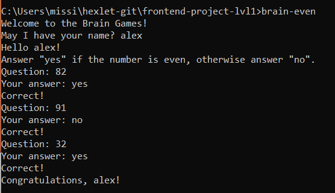
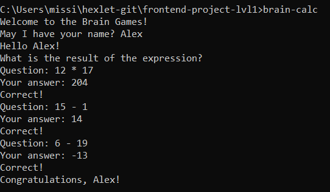
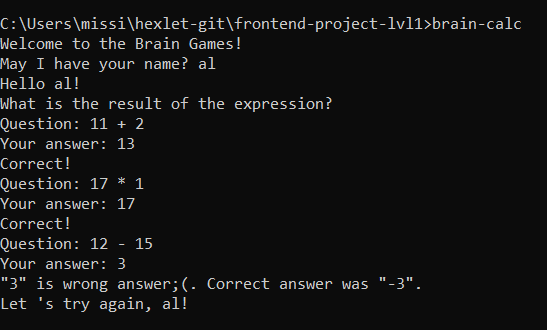
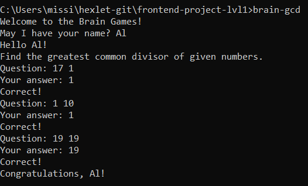
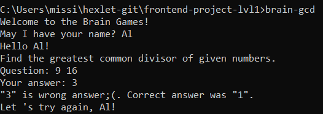
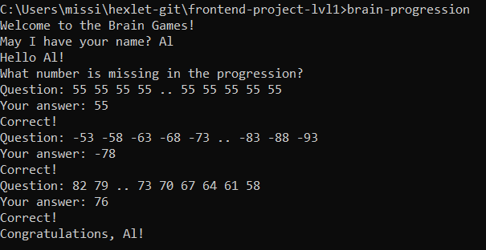
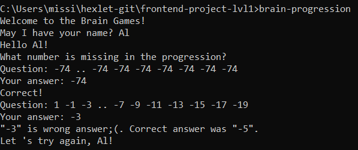
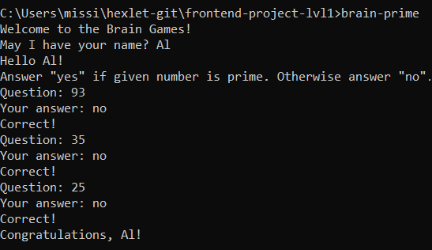
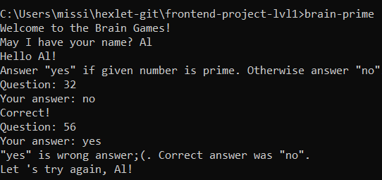

### Hexlet tests and linter status:

Even game: 

Brain-calc if you are right: 

Brain-calc if you made a mistake: 

Greatest common divisor game if you are right: 

Greatest common divisor game if you made a mistake: 

Progression game if you are right: 

Progression game if you made a mistake: 

Prime game if you are right: 

Prime game if you made a mistake: 
